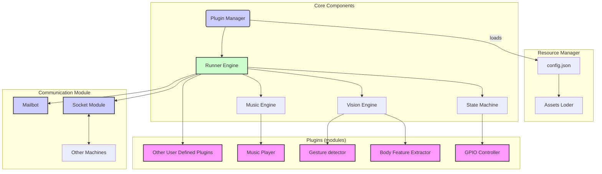

Thread-Everything: 一个简单易用的跨平台多端通信工具
==================================================
[](https://github.com/sergiudm/detectivePi/actions/workflows/mkdocs.yml)
[](https://github.com/sergiudm/detectivePi/actions/workflowstest.yml)
[](https://pypi.org/project/detective-pi/0.2.0/)

## 介绍

Thread-Everything 提供了易用的 Python API 集成*不同*主机上的任何线程

例如：
- 使用单个 Windows 客户端控制远程机器人。
- 基于手势识别的在线动作游戏。
- 智能KTV（手势切歌、氛围灯等）。

## 架构

本项目的核心组件包括：
- 插件管理器
  - 加载插件
- 运行引擎
- 状态机
- 视觉引擎
- 音乐引擎
- 通信模块

## 环境要求
| 环境   | 版本                         |
| ------ | ---------------------------- |
| OS     | Ubuntu22.04, Raspberry Pi OS, Window11, Debian 12|
| Python | 3.10                         |

## 硬件清单
- Raspberry Pi 4B * 2
- 摄像头 * 2
- 蜂鸣器
- LED灯
- 面包板

## 安装
## pip安装
```bash
pip install detective-pi
```

## 源码安装
克隆仓库
```bash
git clone https://github.com/sergiudm/detective.git
cd detective
```
你可以使用`deploy.sh`脚本自动安装
```bash
sudo chmod +x deploy.sh
./deploy.sh
```
或者手动安装
```bash
conda create -n <your_env_name> python=3.10
conda activate <your_env_name>
pip install -r requirements.txt
```

## 使用说明
开始前，你需要配置在项目根目录创建一个`config.json`文件，
以下是一个示例：
```json
{
    "use_pi": false,
    "plugin_list": [
        "information_server",
        "GPIO_controller",
        "music_server",
        "gpio_controller",
        "gesture_detection",
        "meditation_helper",
    ], # 注意：涉及GPIO的插件要开启`use_pi`，如果不使用GPIO相关的库则关闭
    "default_detect_mode": "others",
    "use_camera": true,
    "LED_pin": 18, # LED灯的引脚
    "use_visualization": false, # 是否使用可视化
    "server_email": "youremail@example.com",
    "server_email_password": "your email password",# 请使用授权码
    "target_email": [
        "email1",
        "email2"
    ],
    "smtp_server":"your smtp server",
    "smtp_port": 587,
    "video_path": "assets/videos/sit.mp4", # use_camera为false时，使用该视频
    "image_path": "resources", # 邮件中的图片
    "send_delay": 13,
    "effective_detection_duration": 2,
    "max_num_hands": 2,
    "min_detection_confidence": 0.65,
    "min_tracking_confidence": 0.65,
    "pin_data": {
        "pin_list": [
            17,
            23,
            24,
            25,
            27
        ],
        "pin_map": {
            "Right": [
                17,
                23,
                24
            ],
            "Return": [
                23,
                24
            ],
            "Left": [
                17,
                24
            ],
            "Pause": [],
            "Like": [
                25
            ],
            "OK": [
                27
            ]
        }
    }
}
```
>[!CAUTION] 
实际使用时，请删除`config.json`中的所有注释!

Linux:
```bash
sudo chmod +x run.sh
./run.sh
```
Windows:
```bash
./win_run.bat
```

## 功能
根据你的需求，你可以在`modules`目录下定义自己的插件，我们已经实现了一些插件，包括：
- 手势检测
    - 开启手势线程之后，计算机使用搭载的摄像头捕捉图像信息，并分析画面中的手势，如“OK”、“赞”等。
    - 可以将识别到的手势信息通过通信模块发给多个目标主机。
- 姿势检测
    - 开启姿势线程之后，计算机使用搭载的摄像头捕捉图像信息，并分析画面中的人体姿势，如“sitting”、“slouching”等。
    - 会反馈当前的姿势信息。
- 音乐控制
    - 音乐线程可以控制设备上的音乐流，如播放模式、音量、播放与暂停等。
    - 该线程需要信息的输入，如：通过命令行输入、手势线程的输入。 
    - 将音乐文件放入指定路径，音乐线程即可自动控制。
- 通用GPIO控制器
    - GPIO控制线程只能在树莓派上使用，用于控制GPIO引脚的电平。
    - 该线程需要信息的输入，如：通过命令行输入、手势线程的输入。
- 个性化邮件发送
    - GPIO控制线程只能在树莓派上使用，用于控制GPIO引脚的电平。
    - 该线程需要信息的输入，如：通过命令行输入、手势线程的输入。


## 应用场景举例
Thread-Everything具有高度的可扩展性，可以应用于多种场景。基于现有的插件，我们实现了以下应用场景：

- 冥想助手
    - 应用场景的假设：用户希望在冥想的时候不被外界干扰，如电话、微信等。现阶段的计时器（番茄钟）需要使用手机或者闹钟进行接触式的时间设定，并无法观测用户的姿势是否正确。使用Thread-Everything 实现的冥想助手可以进行无接触式的时间设定与姿势校正提示。
    - 用户使用手势设定冥想时间，并进行冥想。
    - 冥想过程中，树莓派会使用摄像头监控人体姿势，如发现姿势不正确，就会发送提示邮件，提醒用户校正姿势。

 - 智能健身房：步频检测与音乐控制
    - 应用场景的假设：用户在室内健身时，有检测步频的需求。在健身领域中，智能手表常常作为步频检测的工具，但是智能手表有着相当大的局限性，如智能手表的数据采样为随机选取若干周期内的震荡信息（周期性采样），并通过函数映射，获取步频信息。周期性采样方式对与有着长期跑步经验的用户有有效，对于锻炼经验少、身体素质不佳的用户效果不佳。原因是后者的数据周期性远低于前者。使用Thread-Everything 实现的室内健身步频检测可以通过检测图像来记录步数，计算步频，避免了上述问题，实现了更好的效果。基于图像信息，用户还可以通过手势，改变音响播放的音乐，不必在健身时随身携带手机。
    - 检测到人体运动后会计算步频
    - 运动结束后，会发送运动报告邮件，包含运动快照、最高步频等信息。
    - 运动时，用户可以通过手势对音乐流进行操作，如：切歌、播放与暂停等。

## 未来的工作

- 完善视觉后端引擎

## 如何贡献
- 添加更多[插件](https://sergiudm.github.io/Thread-Everything/plugins-tutorial/)
- 提交issue

## Acknowledgement
[mediapipe](https://github.com/google-ai-edge/mediapipe)|
[cv2](https://docs.opencv.org/4.x/index.html)|
[pygame](https://www.pygame.org/docs/)


