Thread-Everything：An easy-to-use interface to run threads from different machines
==================================================

## Introduction

[Thread-Everything](https://github.com/sergiudm/Thread-Everything) provides a simple API to integrate any thread(plugin) from different machines with Python scripts. It can help you to manage your threads and communications more efficiently.

For instance:
- Control remote robots with a single windows client.
- Play online games with gestures with your friends.
- Monitor your home with a single server.
- Universal GPIO scheduler, zero code configuration of GPIO levels, killing all kinds of Lab assignments in college.
- Intelligent fitness room, control the music and lights with gestures.

## Features

- Single-function plugin

    Add your own plugin to the system by simply creating a single Python function in the `plugins` directory

- Single-file management

    All the plugins are managed in a single file(`config.json`), which makes it easy to maintain and manage

- Multi-OS support
  
    Thread-Everything supports machines running on different operating systems, including Ubuntu, Raspberry Pi OS, and Windows

## Architecture

```mermaid
graph TD
    subgraph "Resource Manager"
        C[config.json]
        C-->P[Assets Loader]
    end

    subgraph "Core Components"
        B(Plugin Manager) -- loads--> C
        B --> D[Runner Engine]
        D --> E[State Machine]
        D --> N[Vision Engine]
        D --> F[Music Engine]
    end

    subgraph "Plugins (modules)"
        F --> G[Music Player]
        D --> J[Other User Defined Plugins] 
        N --> H[Body Feature Extractor]
        N --> O[Gesture detector]
        E --> I[GPIO Controller]
    end
    
    subgraph "Communication Module"
      D --> K[Socket Module]
      D --> L[Mailbot]
      K <--> M[Other Machines]
    end

   

    style B fill:#336,stroke:#ccc,stroke-width:2px
    style D fill:#363,stroke:#ccc,stroke-width:2px
    style G fill:#663,stroke:#ccc,stroke-width:2px
    style H fill:#663,stroke:#ccc,stroke-width:2px
    style I fill:#663,stroke:#ccc,stroke-width:2px
    style J fill:#663,stroke:#ccc,stroke-width:2px
    style O fill:#663,stroke:#ccc,stroke-width:2px
    style K fill:#336,stroke:#ccc,stroke-width:2px
    style L fill:#336,stroke:#ccc,stroke-width:2px
```

## Contribution
This project is open to contributions. You can contribute in the following ways:

- Add more plugins
- Improve the existing code

## Future Work

- More robust vision backend
- More plugins

## Acknowledgement
- [mediapipe](https://github.com/google-ai-edge/mediapipe)

- [cv2](https://docs.opencv.org/4.x/index.html)

- [pygame](https://www.pygame.org/docs/)