Thread-Everything：An easy-to-use interface to run threads from different machines
==================================================
[](https://github.com/sergiudm/detectivePi/actions/workflows/mkdocs.yml)
[](https://github.com/sergiudm/detectivePi/actions/workflowstest.yml)
[](https://pypi.org/project/detective-pi/0.2.0/)

## Introduction

Thread-Everything provides a simple API to integrate any thread(plugin) from different machines with Python scripts. It can help you to manage your threads and communications more efficiently.

For instance:
- Control remote robots with a single windows client.
- Play online games with gestures with your friends.
- Monitor your home with a single server.

## Features
- Single-function plugin

    Add your own plugin to the system by simply creating a single Python function in the `plugins` directory

- One-file management

    All the plugins are managed in a single file(`config.json`), which makes it easy to maintain and manage

- Multi-OS support
  
    Thread-Everything supports machines running on different operating systems, including Ubuntu, Raspberry Pi OS, and Windows

## Architecture

```mermaid
graph TD
    subgraph "Resource Manager"
        C[config.json]
        C-->P[Assets Loader]
    end

    subgraph "Core Components"
        B(Plugin Manager) -- loads--> C
        B --> D[Runner Engine]
        D --> E[State Machine]
        D --> N[Vision Engine]
        D --> F[Music Engine]
    end

    subgraph "Plugins (modules)"
        F --> G[Music Player]
        D --> J[Other User Defined Plugins] 
        N --> H[Body Feature Extractor]
        N --> O[Gesture detector]
        E --> I[GPIO Controller]
    end
    
    subgraph "Communication Module"
      D --> K[Socket Module]
      D --> L[Mailbot]
      K <--> M[Other Machines]
    end

   

    style B fill:#336,stroke:#ccc,stroke-width:2px
    style D fill:#363,stroke:#ccc,stroke-width:2px
    style G fill:#663,stroke:#ccc,stroke-width:2px
    style H fill:#663,stroke:#ccc,stroke-width:2px
    style I fill:#663,stroke:#ccc,stroke-width:2px
    style J fill:#663,stroke:#ccc,stroke-width:2px
    style O fill:#663,stroke:#ccc,stroke-width:2px
    style K fill:#336,stroke:#ccc,stroke-width:2px
    style L fill:#336,stroke:#ccc,stroke-width:2px
```


## Environment Requirements       
| Environment | Version                                |
| ----------- | -------------------------------------- |
| OS          | Ubuntu22.04, Raspberry Pi OS, Window11 |
| Python      | >=3.8                                  |

## Installation        
## pip install
```bash
pip install detective-pi
```

## Source code installation

```bash
git clone https://github.com/sergiudm/detective.git
cd detective
conda create -n detective python=3.10 -y
echo "conda environment created"
conda activate detective
pip install -r requirements.txt
```

## Usage
Before you start, you need to create a `config.json` file in the root directory of the project,
Here is an example(you can find it in the `config_template.json`):

```json
{
    "use_pi": false,
    "plugin_list": [ # Note: plugins related to GPIO need to enable `use_pi`, if you don't use GPIO-related libraries, turn it off
        "information_server",
        "GPIO_controller",
        "music_server",
        "gpio_controller",
    ],
    "default_detect_mode": "others",
    "use_camera": true,
    "use_visualization": false, # if you want to see the detection result, set it to true
    "server_email": "youremail@example.com",
    "server_email_password": "your email password",# Note: if you use QQ email, you need to set an app password
    "target_email": [
        "email1",
        "email2"
    ],
    "smtp_server":"your smtp server",
    "smtp_port": 587,
    "video_path": "assets/videos/sit.mp4", # if you want to use a video file for detection, set it here
    "image_path": "resources", # if you want to use an image file for detection, set it here
    "send_delay": 13, # the interval between sending emails
    "effective_detection_duration": 2,
    "max_num_hands": 2,
    "min_detection_confidence": 0.65,
    "min_tracking_confidence": 0.65,
    "pin_data": {
        "pin_list": [ # if you use GPIO, you need to set the pin list
            17,
            23,
            24,
            25,
            27
        ],
        "pin_map": { # mapping the gesture to the pin
            "Right": [
                17,
                23,
                24
            ],
            "Return": [
                23,
                24
            ],
            "Left": [
                17,
                24
            ],
            "Pause": [],
            "Like": [
                25
            ],
            "OK": [
                27
            ]
        }
    }
}
```
!!! warning
    In the `config.json` file, you need to remove all the comments before running the program.     

### Run the program
Linux:
```bash
sudo chmod +x run.sh
./run.sh
```
Windows:
```bash
./win_run.bat
```

## Contribution
This project is open to contributions. You can contribute in the following ways:

- Add more plugins
- Improve the existing code

## Future Work

## Acknowledgement
[mediapipe](https://github.com/google-ai-edge/mediapipe)
[pygame](https://www.pygame.org/news)